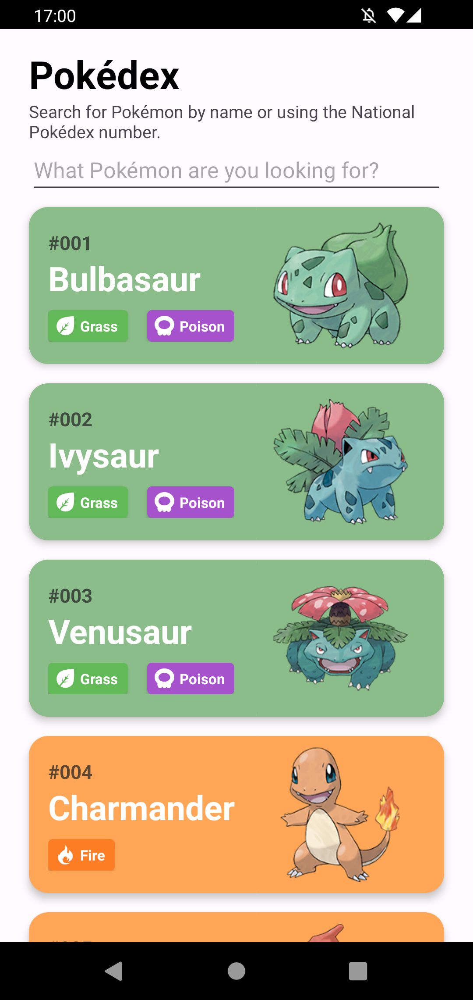
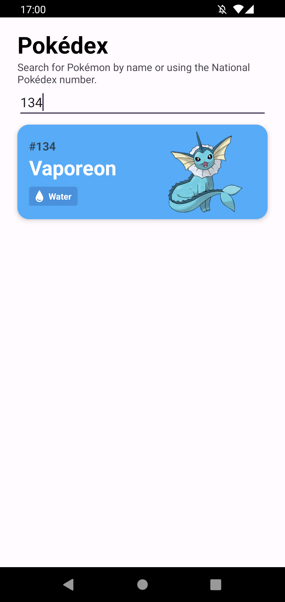
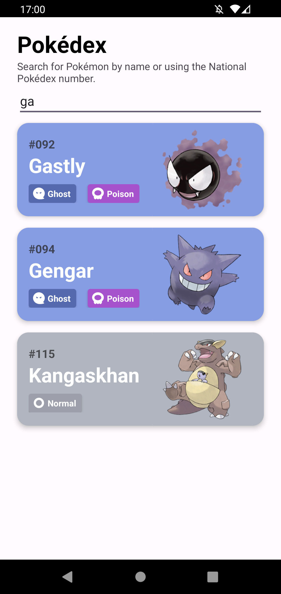
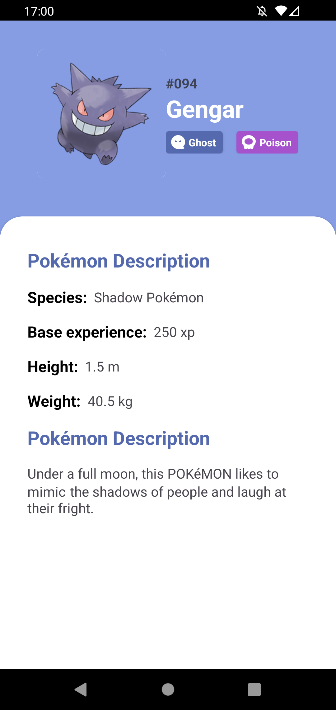

<!-- PROJECT LOGO -->
 

  

<h3 align="center">Pokédex Kotlin</h3>

  

    Check your favourite pokémon with this sleek Kotlin-based Pokédex app!
  

<!--ABOUT THE PROJECT-->

## Screenshots

  
  
  
  

## Built with

* Kotlin

## Features

* [PokeAPI]
* [Retrofit]
* [RecyclerView]
* [ViewModel]
* [ViewHolder]
* [Adapter]
* [LiveData]
* [Glide]
* [Databinding]
* [EditText]
* [Skeletons [Shimmer Loading Effect]]
